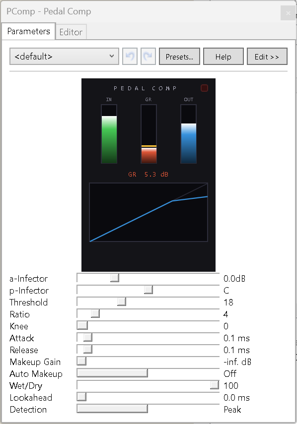

# Pedal Comp

A clean, efficient stereo compressor effect for [ReBuzz](https://github.com/wasteddesign/ReBuzz).



---

## Features

- **Hard or soft knee** — continuously variable knee width from 0 (hard) to 12 dB
- **Peak or RMS detection** — peak for precise transient control, RMS for smoother bus compression
- **Program-dependent release** — release time shortens automatically on sudden signal drops, reducing pumping without manual tuning
- **Lookahead** — up to 20 ms delay on the audio path so the envelope follower sees transients before they arrive, allowing perfect peak catch
- **Wet/Dry mix** — parallel compression; dry path is time-aligned with the wet path via the lookahead buffer
- **Auto makeup gain** — computes the correct output compensation from threshold and ratio automatically
- **Output soft-clip** — gentle saturation stage that rounds off any peaks that make it through, rather than hard-clipping
- **Transfer curve display** — live graph of the input/output compression curve, updates as you move parameters
- **VU metering** — IN, GR and OUT meters with classic ballistics (fast attack, slow release)
- **GR peak hold** — amber hold line on the gain reduction meter, ~1.5 s hold before falling
- **SAT indicator** — lights when the output enters the soft-clip zone; auto-clears after ~2 s, click to reset immediately
- **Zero CPU when idle** — drops to no CPU use when no signal is present

---

## Parameters

| Parameter | Range | Default | Description |
|---|---|---|---|
| Threshold | 0 – 60 | 18 | Compression threshold. Value = dB below 0 dBFS. Higher = more compression. |
| Ratio | 1 – 30 | 4 | Compression ratio N:1. 1 = no compression, 30 = near-limiting. |
| Knee | 0 – 12 | 0 | Soft-knee width in dB. 0 = hard knee. |
| Attack | 1 – 200 ms | 10 | How fast the compressor responds to rising levels. |
| Release | 10 – 2000 ms | 100 | How fast the compressor recovers. Automatically shortens on sudden drops. |
| Makeup Gain | 0 – 24 dB | 0 | Output gain to compensate for compression. Ignored when Auto Makeup is on. |
| Auto Makeup | Off / On | Off | Computes makeup gain automatically from threshold and ratio. |
| Wet/Dry | 0 – 100 | 100 | Blend between compressed (wet) and dry signal. |
| Lookahead | 0 – 20 ms | 0 | Delay on audio path for perfect transient detection. Adds equivalent latency. |
| Detection | Peak / RMS | Peak | Envelope detection mode. |

---

## Building

Requires the [.NET 10 SDK](https://dotnet.microsoft.com/download) and ReBuzz installed at `C:\Program Files\ReBuzz\`.

Open PowerShell **as Administrator** (required to write to Program Files) and run:

```powershell
.\Setup.ps1
```

This verifies the ReBuzz reference DLLs are present and builds the project. The output DLL is written directly to:

```
C:\Program Files\ReBuzz\Gear\Effects\Pedal Comp.NET.dll
```

Restart ReBuzz and **Pedal Comp** will appear in the Effects list.

---

## Version History

| Version | Changes |
|---|---|
| 1.3 | Fast log/exp in DSP hot path, auto makeup gain, GR peak hold, transfer curve display |
| 1.2 | Cached DSP coefficients, output soft-clip, program-dependent release, Peak/RMS label |
| 1.1 | Zero CPU when idle (WM_NOIO), RMS detection mode, auto-clearing SAT indicator |
| 1.0 | Initial release — threshold, ratio, knee, attack, release, makeup, wet/dry, lookahead |
